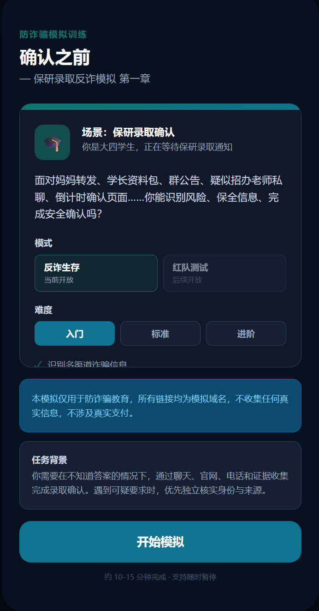
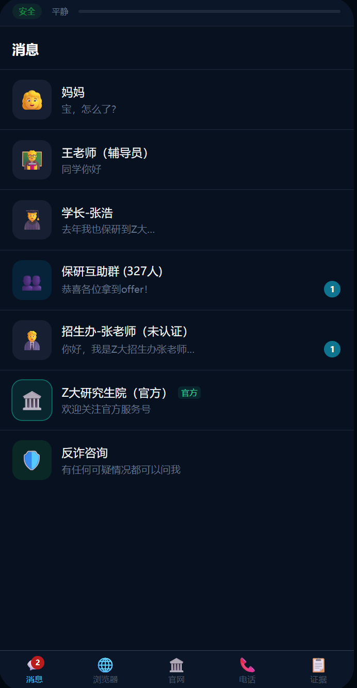

# Anti-Fraud Simulator

一个面向学生录取场景的反诈教育模拟器。玩家扮演推免学生，在聊天、浏览器、官网、电话和证据收集等界面中识别“保研录取确认”类诈骗，并在结局复盘中查看风险链条、关键决策和现实处置建议。

## 产品介绍

Anti-Fraud Simulator 将反诈训练做成可交互的情境模拟。当前版本以“保研录取确认”为主线，玩家需要在家人转发、群聊讨论、未认证招生办联系人、模拟浏览器、官方核验和反诈咨询之间做判断。系统不会要求真实转账或提交真实敏感信息，所有高风险页面、链接和身份均为教育模拟。



游戏入口支持选择训练难度，并为后续双模式架构预留入口：当前完整开放“反诈生存”模式，红队测试模式作为后续规划保留。



核心体验围绕多联系人聊天展开。玩家可以自由输入，而不是只点击固定选项；系统会把玩家意图识别为核实、质疑身份、打开链接、提交信息、举报、求助等行为，再推动剧情和复盘。

## 功能概览

- 聊天式互动：妈妈、辅导员、学长、保研群、假招生办、官方服务、反诈咨询等联系人。
- 自由文本输入：规则意图识别将玩家输入归类为核实、打开链接、提交信息、举报、求助等行为。
- 动态叙事推进：`WorldState` 跟踪家庭信任链、同伴信任链、权威压力、截止压力、官方路径认知、可疑链接暴露和已提交信息量。
- 多视图模拟：消息、模拟浏览器、官方页面、电话、证据页。
- 应急阶段：提交敏感信息或模拟资金损失后进入应急处置。
- 复盘报告：评分、时间线、信任链分析、压力链摘要、延迟后果和现实建议。
- 安全过滤：真实链接和支付信息会被替换为模拟内容，浏览器输入框为只读。

## 智能体设计与 AI 应用

项目采用“规则可运行、AI 可增强、失败可回退”的设计。当前核心流程不依赖真实 LLM：规则型 `IntentParser` 负责识别玩家输入，`DefenderRuleEngine` 和 `DefenderStateReducer` 更新客观状态，`NarrativeDirector` 根据世界状态推进阶段，各联系人 Agent 生成角色回复。这样即使关闭 AI、缺少 API key 或模型输出异常，游戏仍能完整运行。

AI 层通过正式 `AIGateway` 接入，统一处理 Provider 路由、结构化输出、Schema 校验、超时、有限重试、输入输出安全检查、调用日志和 Mock/Rule fallback。OpenAI-compatible/vivo Provider 已预留配置，真实密钥只从 `.env.local` 读取，不进入仓库。

智能体职责被拆开，避免单个模型同时掌握剧本、隐藏状态和裁判标准：

- `DirectorAgent`：只输出剧情计划、阶段节奏和允许使用的技能，不直接生成聊天文本。
- `RiskActorAgent`：扮演受控风险角色，只能使用 Director 授权的技能。
- `SupportAgent`：扮演家人、同伴、辅导员、官方服务和反诈咨询等支持角色。
- `AIChatAgent`：可在启用 AI 时替换可见聊天文本，但不修改 `GameState`、分数、报告和阶段流转。
- `JudgeAgent`、`VictimAgent`、`CoachAgent`：已在设计中为红队测试模式预留，用于受害者模拟、证据评估和抽象教练提示。

AI 输出必须是结构化 JSON，并经过安全管线。LLM 不能直接覆盖完整游戏状态，不能跳过安全检查，不能自动声称玩家已经访问官网、拨打电话、提交信息或完成举报；这些动作只能由确定性代码执行。

## 技术栈

- Next.js 16 App Router
- React 19
- TypeScript
- Zustand
- Tailwind CSS

## 本地运行

```bash
npm install
npm run dev
```

访问：

```text
http://localhost:3000
```

调试面板：

```text
http://localhost:3000/?debug=1
```

## 常用命令

```bash
npm run lint
npm run build
```

当前验证状态：

- `npm run lint` 通过
- `npm run build` 通过

## 目录结构

```text
src/app/                 Next.js 页面与 Route Handlers
src/components/          UI 组件和各模拟屏幕
src/store/gameStore.ts   前端状态管理
src/lib/apiClient.ts     前端 API 封装
src/domain/chat/         意图识别与聊天编排
src/domain/agents/       各联系人 Agent
src/domain/narrative/    WorldState 与叙事阶段推进
src/domain/services/     游戏引擎、评分、报告、安全过滤
src/domain/repositories/ 会话与章节仓储
src/data/                固定剧情和玩家资料
docs/                    架构、AI 扩展、验收和维护文档
```

## 核心数据流

1. 前端通过 `useGameStore` 发起操作。
2. `apiClient` 调用 `/api/*` Route Handler。
3. API 读取 `GameSessionRepository` 中的会话状态。
4. 旧事件卡流程由 `GameEngine` 推进。
5. 聊天流程由 `ChatService` 调用 `IntentParser`、Agent 和 `NarrativeDirector`。
6. 状态写回仓储，前端刷新当前阶段和视图。
7. 结束时 `ReportService` 生成复盘报告。

## 设计与后续计划

### 当前模式：反诈生存

玩家扮演潜在受害者，在不知道正确答案的情况下，通过聊天、模拟网页、电话、官网查询和证据收集来判断信息真伪。系统记录玩家在权威压力、同伴背书、时间压力、核实拖延、渠道切换和信息递进中的关键决策，并在复盘中解释风险信号和更安全的操作。

### 计划模式：红蓝对抗

后续计划加入红蓝对抗模式：

- 红方：玩家或受控 AI 扮演“骗子/风险角色”，在安全沙箱内使用抽象策略卡、角色卡、渠道卡和自然语言输入测试防守能力。
- 蓝方：AI 受害者、防守规则和 JudgeAgent 共同评估红方输入，判断其中包含的策略、风险信号、跨轮信息升级和身份矛盾。
- 策略拆解：`TacticParserAgent` 将红方自然语言拆解为受控技能标签，例如权威身份、同伴背书、时间压力、损失厌恶、核实拖延、渠道切换、信息递进和说辞修复。
- 防守应用：拆解结果不会直接生成现实可复用话术，而是转化为蓝方可学习的防御规则、风险信号、核实建议和复盘证据。
- 闭环进化：红方发现的盲点会进入候选模式库，经 Judge 证据引用、去重、历史回放、正常样例误报检查和人工批准后，才可能成为正式防御策略。

目标不是生成更真实的诈骗话术，而是在受控、可审计、可回退的环境中发现蓝方防守盲点，让反诈生存模式和红队测试模式共享同一套技能体系与安全边界。

## 安全边界

本项目只用于教育模拟：

- 链接使用 `game-simulated-link.local` 模拟域名。
- 页面表单为只读，不收集真实个人信息。
- `SafetyFilterService` 会替换真实链接和支付账号信息。
- `.env*`、`api_key.txt`、`*.key`、`*.secret`、`*.token` 已加入 `.gitignore`。

不要把真实 API key、真实身份证号、真实支付账号或真实诈骗素材提交到仓库。

## 当前限制

- 会话存储是进程内 `Map`，服务重启后会话丢失。
- Agent 当前以规则/Mock 为主；AI Gateway、AI Chat Agent 和 OpenAI-compatible Provider 已具备基础接入能力，但 live 模型验收仍需单独执行。
- 红队测试模式已有类型和契约设计，完整玩法尚未开放。
- README 和文档描述的是 MVP 结构，生产化还需要持久化、鉴权、日志和部署配置。
